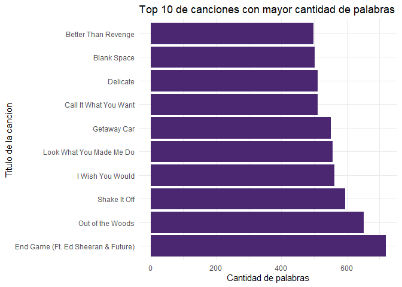
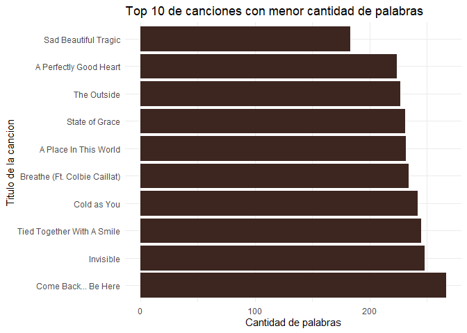

Taylor Swift Viz
================
Natalia Esquenazi
11/12/2021

## Objetivo

Este analisis tiene el objetivo de estudiar cuantitativamente el
desempeño musical de Taylor Swift, artista a la cual admiro por su
trabajo en defensa de los derechos de las mujeres y diversidades.

La motivacion principal esta orientada a generar una visualizacion
interactiva que utilize un dataset con letras de sus canciones y el
paquete TayloRswift con colores caracteristicos de la artista.

## Analisis Exploratorio

Primero instalamos las siguientes librerias:

``` r
library(tidyverse)
```

    ## -- Attaching packages --------------------------------------- tidyverse 1.3.0 --

    ## v ggplot2 3.3.3     v purrr   0.3.4
    ## v tibble  3.1.0     v dplyr   1.0.5
    ## v tidyr   1.1.3     v stringr 1.4.0
    ## v readr   1.3.1     v forcats 0.5.1

    ## -- Conflicts ------------------------------------------ tidyverse_conflicts() --
    ## x dplyr::filter() masks stats::filter()
    ## x dplyr::lag()    masks stats::lag()

``` r
library(dplyr)
library(tidyr)
library(ggplot2)  
library(plotly)
```

    ## 
    ## Attaching package: 'plotly'

    ## The following object is masked from 'package:ggplot2':
    ## 
    ##     last_plot

    ## The following object is masked from 'package:stats':
    ## 
    ##     filter

    ## The following object is masked from 'package:graphics':
    ## 
    ##     layout

``` r
library(readr)
```

Para descargar el paquete de Taylor Swift hay que hacerlo de la
siguiente manera:

``` r
library(tayloRswift)
```

El dataset de letras de musica cuenta con 4862 observaciones y las
siguientes variables:

  - artist
  - album
  - track\_title
  - track\_n
  - lyric
  - line
  - year

Empecemos cargando el dataset, usando las herramientas que nos da
Tidyverse.

``` r
df <- read_csv("taylor_swift_lyrics.csv")
```

    ## Parsed with column specification:
    ## cols(
    ##   artist = col_character(),
    ##   album = col_character(),
    ##   track_title = col_character(),
    ##   track_n = col_double(),
    ##   lyric = col_character(),
    ##   line = col_double(),
    ##   year = col_double()
    ## )

Primero me voy a quedar con el top 10 de canciones que tengan mayor
cantidad de palabras y luego agrupamos la cantidad de palabras
detectadas por titulo de cancion.

``` r
df$length <- str_count(df$lyric,"\\S+")
```

``` r
length_df <- df %>%
group_by(track_title) %>%
summarise(length = sum(length))
```

Voy a realizar la primera visualizacion\!

``` r
plot_1 <- length_df %>%
  arrange(desc(length)) %>%
  slice(1:10) 

plot_1 %>% 
  ggplot(aes(x= reorder(track_title, -length), y=length)) +
    geom_bar(stat="identity", fill="#8c8c8c")+
    coord_flip()+
    ylab("Cantidad de palabras") + 
    xlab ("Titulo de la cancion") +
    ggtitle("Top 10 de canciones con mayor cantidad de palabras") +
    theme_minimal() 
```

<!-- --> En el grafico podemos
observar el top 10 de canciones con mayor cantidad de palabras de Taylor
Swift, en la cual “End Game” es una de las mas largas\!

Ahora en una segunda visualizacion obervo el top 10 de canciones con
menor cantidad de palabras

``` r
plot_2 <- length_df %>%
  arrange(length) %>%
  slice(1:10) 

plot_2 %>% 
  ggplot(aes(x= reorder(track_title, -length), y=length)) +
    geom_bar(stat="identity", fill="#b4a382")+
    coord_flip()+
    ylab("Cantidad de palabras") + 
    xlab ("Titulo de la cancion") +
    ggtitle("Top 10 de canciones con menor cantidad de palabras") +
    theme_minimal() 
```

<!-- -->

Finalmente observo la distribucion de la cantidad de palabras de las
canciones

``` r
plot_3 <- ggplot(data = length_df,
                 mapping = aes(x = length)) + 
          geom_histogram(bins = 30, aes(fill = ..count..))+
          geom_vline(aes(xintercept=mean(length)), color="#FFFFFF", linetype="dashed", size=1)+
          theme_minimal()+
          scale_fill_taylor(palette = "lover", guide = "none", discrete = FALSE)+
          ylab("Count") + 
          xlab ("Cantidad de palabras") +
          ggtitle("Distribucion de la cantidad de palabras")
```
